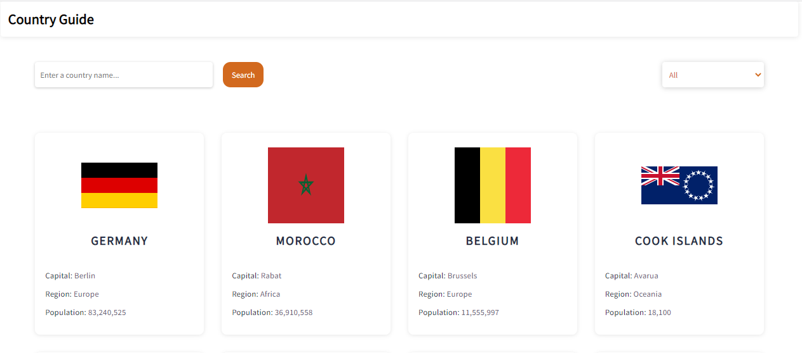
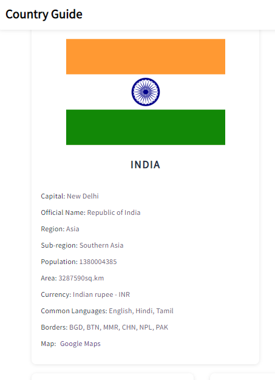

# html-css-project-boilerplate

# **Country Guide**

###### Home page

  

**_It's a website for learnig about countries._**

### **Information about every country in the world?**
​
###### _Search Specific country to know more._
​
###### _View by Region wise._
​
###### _View All country detail At a time._
​
### **Progress**
​
_It's currently at a very early development stage but hoping to get it available to you with more funtionalities very soon!_

### **Hosted link**
​
**https://country-guide1.netlify.app/**
​
#### Languages used
- _JavaScript_
- _HTML_
- _CSS_
- _Json_
- _API(REST Countries API)_
#### Workings
​
- _At first Home page shows All the country details by row._
- _Search Button._
- _Region selector._
#### Also works fine device with small screen

###### Mobile view(java)

  

#### Refernces
- _W3 Schools (https://www.w3schools.com/)_
